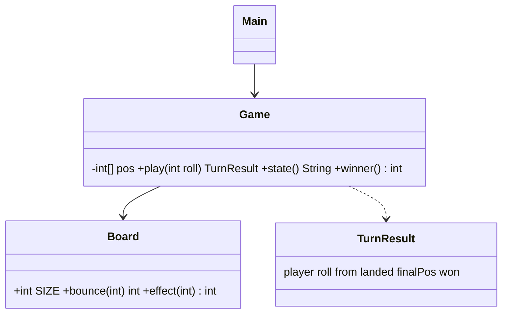

# UML inicial (colar em mermaid.live para exportar imagem)

```mermaid
classDiagram
class Board { +int SIZE +bounce(int) int +effect(int) int }
class Game { -int[] pos +play(int roll) TurnResult +state() String +winner() int }
class TurnResult { player roll from landed finalPos won }
class Main
Main --> Game
Game --> Board
Game ..> TurnResult
```
Plano para novembro: interface `Cell` (`NormalCell`, `AdvanceCell`, `ReturnCell`) e interface `Dice` (`RandomDice`, `ManualDice`).
