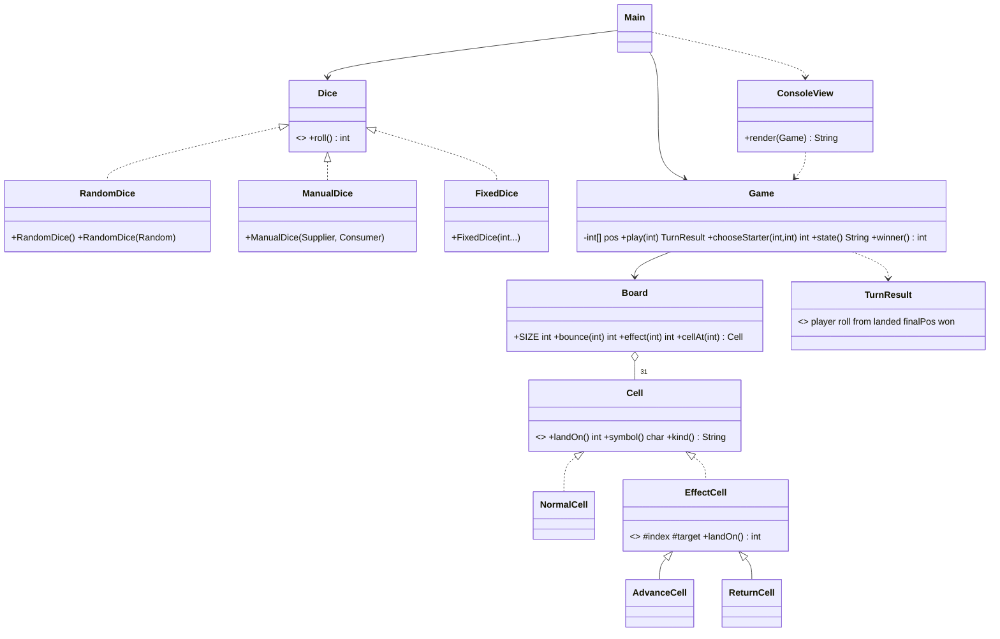

# UML (versão de novembro)
Cola o bloco em mermaid.live para exportar a imagem.

```mermaid
classDiagram
class Dice { <<interface>> +roll() int }
class RandomDice { +RandomDice() +RandomDice(Random) }
class ManualDice { +ManualDice(Supplier, Consumer) }
class FixedDice { +FixedDice(int...) }
Dice <|.. RandomDice
Dice <|.. ManualDice
Dice <|.. FixedDice
class Cell { <<interface>> +landOn() int +symbol() char +kind() String }
class NormalCell
class EffectCell { <<abstract>> #index #target +landOn() int }
class AdvanceCell
class ReturnCell
Cell <|.. NormalCell
Cell <|.. EffectCell
EffectCell <|-- AdvanceCell
EffectCell <|-- ReturnCell
class Board { +SIZE int +bounce(int) int +effect(int) int +cellAt(int) Cell }
class Game { -int[] pos +play(int) TurnResult +chooseStarter(int,int) int +state() String +winner() int }
class TurnResult { <<record>> player roll from landed finalPos won }
class ConsoleView { +render(Game) String }
class Main
Board o-- "31" Cell
Game --> Board
Game ..> TurnResult
Main --> Game
Main --> Dice
Main ..> ConsoleView
ConsoleView ..> Game
```
